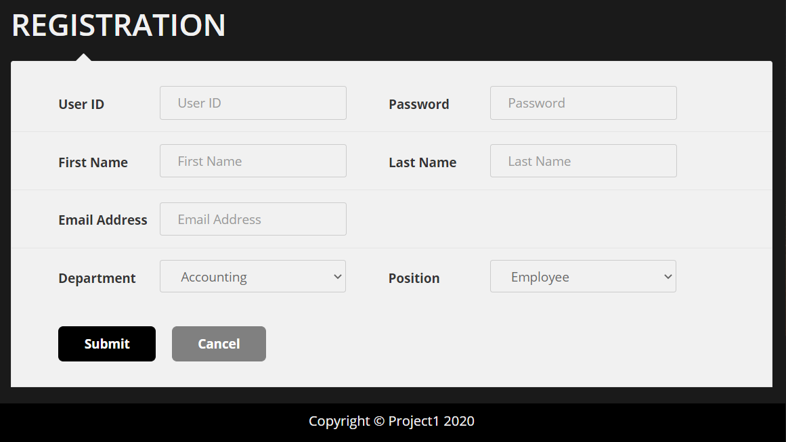
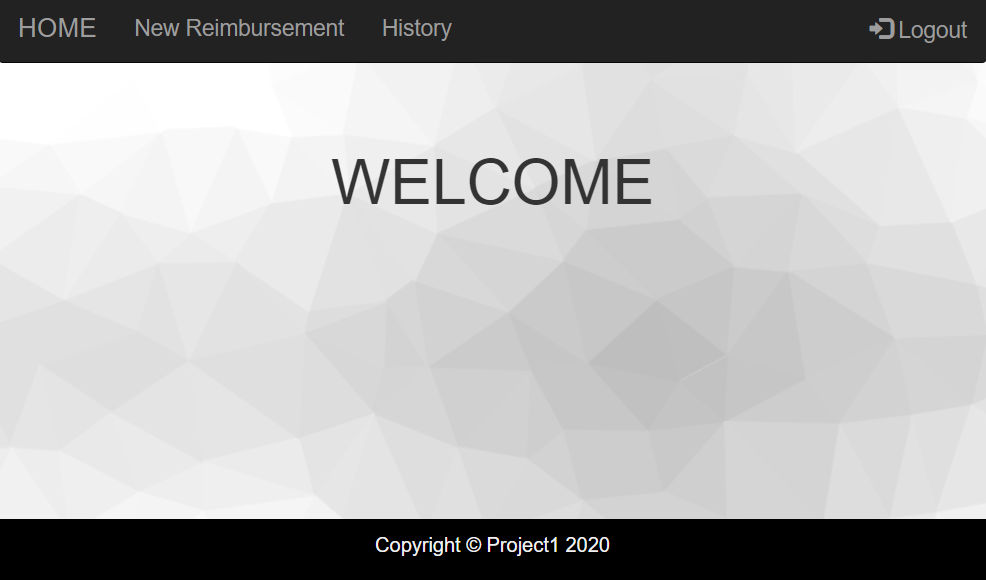
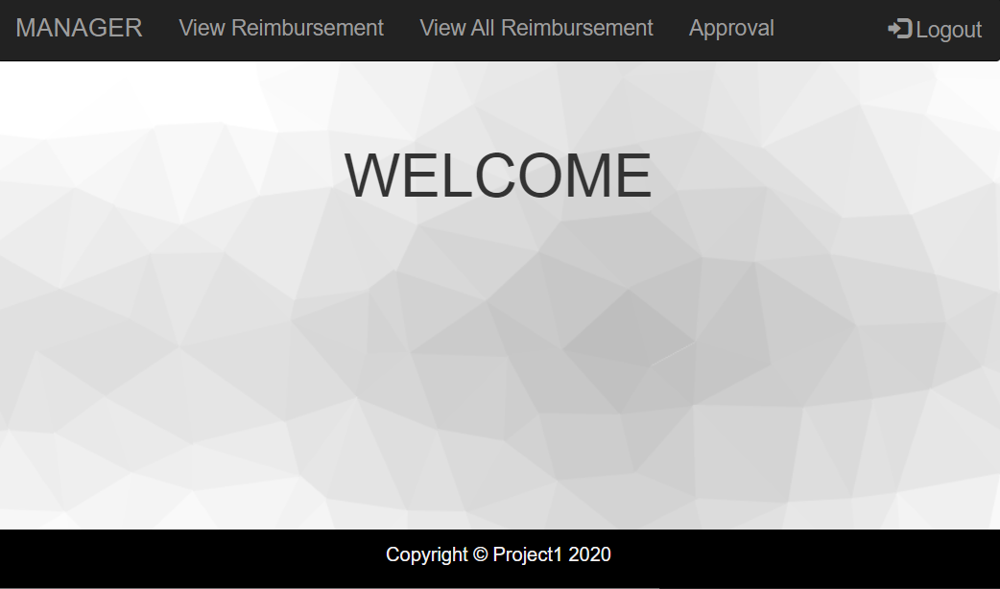

# Expense Reimbursement System

## Project Description

The Expense Reimbursement System (ERS) is to manage the process of expense reimbursement. It is required different functionalities based on user's role: Finance Managers and Employees.

## Technical Requirements

[FrontEnd]
* JavaScript - ECMAScript 5
* HTML5
* CSS - Bootstrap 4
* Fetch API - Chrome version 68

[BackEnd]
* Java 1.8.0 - JDK 8
* JDBC
* PostgreSQL 13.1
* Tomcat Server (Servlet)
* Cross Origin Resource Sharing

[Development Tools]
* Eclipse
* Visual Studio Code
* Postman
* Amazon Web Service(AWS)
* DBeaver

## Features

List of features ready and TODOs for future development
* Users can register and login
* Employees can submit new reimbursememt request
* Employees can view past tickets
* Employees can view thier pending lists
* Finance Managers can view reimbursement requests assigned to them
* Finance Managers can view all reimbursement regardless of approvers
* Finance Managers can view past histories for all employees
* Finance Managers can approve and reject reimbursement requests

To-do list:
* Employees can store image files
* Upgrade UI

## Getting Started
   

1. Download the code from git hub
   - git clone https://github.com/2011Canada/project-1-jinyoung453.git

2. Setup Database Management System for PostgreSQL
   - set data structure using 'ERS.sql'
   
3. Set Environment Variables : DB_URL, DB_USER, DB_PASSWORD

4. Run Server(Tomcat is recommended)

5. Open a browser(Chrome is recommended)
   - http://localhost:8080/Servlet/login.html

## Usage

- Users can reach to a Reimbursement System where they can login

- Users can register

- Employee can login
- Employee can submit new reimbursement and view pending list

- Finance Manager can login
- Finance Manager can view reimbursememt lists assigned to them
- Finance Manager can view all reimbursement lists regardless of approvers

- Users can logout

## Entity Relationship Diagram

## License

This project uses the following license: [GNU GENERAL PUBLIC LICENSE](<https://www.gnu.org/licenses/gpl-3.0.en.html>).

